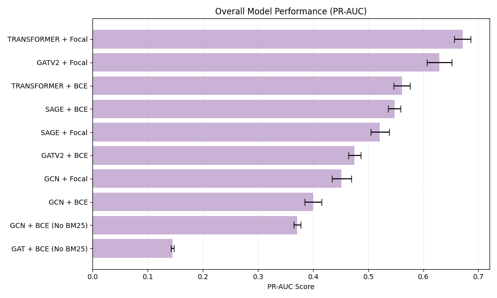

# GNN Training for Multi-Label Classification

This directory contains the training scripts for Graph Neural Network (GNN) models on the Hugging Face knowledge graph for multi-label task classification.

## Overview

The training pipeline supports multiple GNN architectures and training configurations for classifying models and datasets into their associated tasks. The system uses node features (BGE embeddings + optional BM25 features) and graph structure to predict multi-label task assignments.

## Supported Models

- **GCN** (Graph Convolutional Network)
- **GAT** (Graph Attention Network)
- **SAGE** (GraphSAGE)
- **GraphTransformer** (Transformer-based GNN)
- **GATv2** (GATv2 with edge attributes)

## Features

- **Multi-seed evaluation**: Runs 10 different random seeds for robust performance estimation
- **Focal Loss support**: Optional Focal Loss for handling class imbalance
- **Feature selection**: Option to use BGE embeddings only (768 dim) or BGE + BM25 (822 dim)
- **Early stopping**: Validation-based early stopping with patience
- **Comprehensive metrics**: Micro-F1, Macro-F1, and PR-AUC scores
- **Model checkpointing**: Saves best model and scaler for inference

## Requirements

```bash
pip install torch torch-geometric scikit-learn joblib numpy
```

## Usage

### Basic Training

Train a GCN model with default settings:

```bash
python train.py \
    --model_type gcn \
    --graph_path ../experiment_runs/run_2025-10-11_13-12-14/final_graph.pt \
    --save_dir ./results/gcn_run
```

### Training with Focal Loss

Use Focal Loss to handle class imbalance:

```bash
python train.py \
    --model_type gat \
    --graph_path ../experiment_runs/run_2025-10-11_13-12-14/final_graph.pt \
    --save_dir ./results/gat_focal \
    --use_focal
```

### Training with BGE-only Features

Exclude BM25 features and use only BGE embeddings:

```bash
python train.py \
    --model_type sage \
    --graph_path ../experiment_runs/run_2025-10-11_13-12-14/final_graph.pt \
    --save_dir ./results/sage_bge_only \
    --exclude_bm25
```

### Training GraphTransformer/GATv2 (with edge attributes)

Models that support edge attributes:

```bash
python train.py \
    --model_type transformer \
    --graph_path ../experiment_runs/run_2025-10-11_13-12-14/final_graph.pt \
    --save_dir ./results/transformer_run
```

## Command-Line Arguments

| Argument | Type | Required | Default | Description |
|----------|------|----------|---------|-------------|
| `--model_type` | str | Yes | - | Model architecture: `gcn`, `gat`, `sage`, `transformer`, `gatv2` |
| `--graph_path` | str | Yes | - | Path to the graph `.pt` file |
| `--save_dir` | str | Yes | - | Directory to save model checkpoints and results |
| `--hidden_size` | int | No | 256 | Hidden dimension size |
| `--dropout` | float | No | 0.5 | Dropout rate |
| `--use_focal` | flag | No | False | Use Focal Loss instead of BCE |
| `--exclude_bm25` | flag | No | False | Use only BGE embeddings (drop BM25 features) |

## Training Details

### Loss Functions
- **BCE Loss** (default): Standard binary cross-entropy with logits
- **Focal Loss** (`--use_focal`): Handles class imbalance with `alpha=0.25` and `gamma=2.0`

### Training Configuration
- **Optimizer**: AdamW with learning rate `0.001` and weight decay `0`
- **Max epochs**: 500
- **Early stopping**: Patience of 100 epochs based on validation Macro-F1
- **Evaluation frequency**: Every 10 epochs
- **Random seeds**: 10 seeds `[42, 100, 2023, 123, 999, 41, 99, 2022, 122, 998]`

### Evaluation Metrics
- **Micro-F1**: Overall F1 score across all labels
- **Macro-F1**: Average F1 score per class
- **PR-AUC**: Area under the precision-recall curve (macro-averaged)
- **Per-class F1**: Individual F1 scores for each task class

## Output

The training script generates:

1. **Model checkpoint** (`model.pt`): Best model state (from seed 42)
2. **Scaler** (`scaler.pkl`): StandardScaler used for feature normalization
3. **Performance visualization** (`smoking_gun_{model_type}.png`): Long-tail performance analysis plot
4. **Console output**: Aggregated metrics (mean ± std) across all seeds

### Output Format

```
Final Aggregated Results (10 runs)
Model: GCN | Loss: BCE
Features: BGE + BM25 (822)
----------------------------------------
TEST_MACRO_STD        : 0.4912 ± 0.0123
TEST_MICRO_STD       : 0.5528 ± 0.0089
TEST_PR_AUC_STD      : 0.6032 ± 0.0101
VAL_MACRO_F1         : 0.8918 ± 0.0056
VAL_MICRO_F1         : 0.9284 ± 0.0034
VAL_PR_AUC           : 0.9268 ± 0.0045
========================================
```

## Dependencies

The training script requires:
- `utils.py` module with functions:
  - `initialize_bias()`: Initialize bias for Focal Loss
  - `analyze_long_tail_performance()`: Generate performance visualization
  - `fix_graph_data()`: Convert graph format

Make sure `utils.py` is in your Python path or in the same directory.

## Performance Results

All results are averaged over 10 random seeds with mean ± standard deviation reported.

| Model | Loss | Features | Val Micro-F1 | Test Micro-F1 | Test Macro-F1 | Test PR-AUC | Head F1 (Top 10) | Tail F1 (Rest) | Gap |
|-------|------|----------|--------------|---------------|---------------|-------------|------------------|----------------|-----|
| GAT | BCE | BGE Only (768) | 0.6901 ± 0.0020 | 0.2175 ± 0.0038 | 0.0493 ± 0.0013 | 0.1450 ± 0.0028 | 0.3439 | 0.0129 | 0.3311 |
| GCN | BCE | BGE Only (768) | 0.8016 ± 0.0021 | 0.4685 ± 0.0058 | 0.1788 ± 0.0051 | 0.3713 ± 0.0063 | 0.4987 | 0.1859 | 0.3128 |
| GCN | BCE | BGE + BM25 (822) | 0.8916 ± 0.0022 | 0.4838 ± 0.0037 | 0.1692 ± 0.0125 | 0.4002 ± 0.0155 | 0.5217 | 0.0857 | 0.4360 |
| GCN | Focal | BGE + BM25 (822) | 0.8755 ± 0.0088 | 0.4704 ± 0.0205 | 0.1829 ± 0.0115 | 0.4520 ± 0.0173 | 0.4712 | 0.1666 | 0.3046 |
| SAGE | BCE | BGE + BM25 (822) | 0.9270 ± 0.0006 | 0.5890 ± 0.0246 | 0.2040 ± 0.0038 | 0.5478 ± 0.0111 | 0.6464 | 0.1182 | 0.5282 |
| SAGE | Focal | BGE + BM25 (822) | 0.9146 ± 0.0013 | 0.5928 ± 0.0494 | 0.1710 ± 0.0138 | 0.5213 ± 0.0166 | 0.6354 | 0.0983 | 0.5371 |
| TRANSFORMER | BCE | BGE + BM25 (822) | 0.9246 ± 0.0012 | 0.6270 ± 0.0613 | 0.2069 ± 0.0090 | 0.5613 ± 0.0147 | 0.7342 | 0.1199 | 0.6143 |
| TRANSFORMER | Focal | BGE + BM25 (822) | 0.9242 ± 0.0008 | **0.6876 ± 0.0540** | **0.2319 ± 0.0194** | **0.6713 ± 0.0148** | 0.6602 | 0.2156 | 0.4445 |
| GATV2 | BCE | BGE + BM25 (822) | 0.9191 ± 0.0011 | **0.7124 ± 0.0051** | 0.1945 ± 0.0089 | 0.4753 ± 0.0111 | 0.6469 | 0.0738 | 0.5731 |
| GATV2 | Focal | BGE + BM25 (822) | 0.9212 ± 0.0015 | 0.7085 ± 0.0082 | 0.2140 ± 0.0168 | 0.6290 ± 0.0226 | 0.6504 | 0.1004 | 0.5500 |

### Performance Visualizations


*Comparison of Test Micro-F1 scores across different models and configurations*



*Ranking of models by Test PR-AUC scores*

### Key Findings

1. **Best Test Micro-F1**: GATV2 with BCE Loss achieves **0.7124 ± 0.0051** (most stable)
2. **Best Test PR-AUC**: TRANSFORMER with Focal Loss achieves **0.6713 ± 0.0148**
3. **Best Test Macro-F1**: TRANSFORMER with Focal Loss achieves **0.2319 ± 0.0194**
4. **BM25 Impact**: Adding BM25 features significantly improves performance (compare GCN BGE-only vs BGE+BM25)
5. **Focal Loss**: Generally improves PR-AUC and Macro-F1, but may reduce Micro-F1 for some models
6. **Long-tail Performance**: Head F1 (top 10 tasks) is consistently higher than Tail F1 (remaining tasks), indicating class imbalance challenges

**Note**: Head F1 refers to performance on the top 10 most frequent task classes, while Tail F1 refers to the remaining task classes. The Gap metric measures the performance difference between head and tail classes.

## Notes

- The script uses deterministic algorithms for reproducibility
- Models are evaluated on validation set every 10 epochs
- Best model (based on validation Macro-F1) is saved for seed 42
- Feature normalization is applied using StandardScaler fitted on training data
- For models with edge attributes (Transformer, GATv2), ensure the graph includes `edge_attr`

