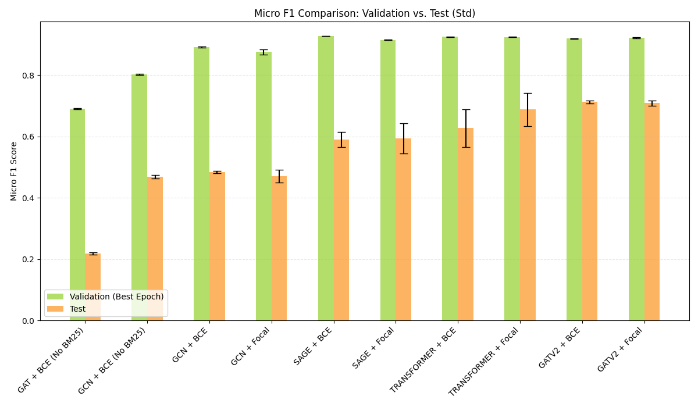
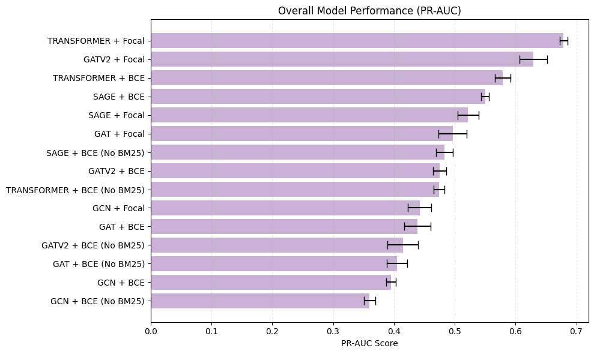

# Model Training and Evaluation

This directory contains all model training and evaluation code for the Hugging Face Knowledge Graph project. It includes both pure Graph Neural Network (GNN) approaches and hybrid LLM + Graph approaches (GRetriever).

## Directory Structure

```
models/
├── model_utils.py           # Shared GNN model definitions (GCN, GAT, SAGE, etc.)
├── utils.py                 # Shared utilities (graph loading, training helpers)
├── train.py                 # Main GNN training script
├── gretriever-pending/      # LLM + Graph hybrid (GRetriever)
│   ├── gretriever.py        # GRetriever implementation
│   ├── finetune_llm_taskclass.py  # Fine-tune for task classification
│   ├── finetune_llm_linkpred.py    # Fine-tune for link prediction
│   ├── gret_eval.py         # GRetriever evaluation script
│   ├── create_classification_evalset.py
│   ├── eval.py                  # Evaluate fine-tuned LLM models for task classification
│   ├── examine_eval.py          # Examine evaluation results from JSON files
│   └── plot_eval.py             # Create visualizations from evaluation results
└── README.md                # This file
```

## Shared Components

### Models (`model_utils.py`)

All GNN architectures are defined in a single shared module:

- **GCN**: Graph Convolutional Network
- **GAT**: Graph Attention Network
- **SAGE**: GraphSAGE
- **GraphTransformer**: Transformer-based GNN
- **GATv2**: GATv2 with edge attributes

### Utilities (`utils.py`)

Shared utility functions used across training and evaluation:

- **`fix_graph_data()`**: Convert CogDL graph to PyTorch Geometric Data format
- **`initialize_bias()`**: Initialize bias for Focal Loss training
- **`analyze_long_tail_performance()`**: Generate long-tail performance visualization
- **`print_stats()`**: Print graph statistics (train/val/test splits)
- **`convert2group()`**: Group relationship data into dictionaries
- **`encode_onehot()`**: Create one-hot encoded matrices for multi-label data

## Usage

### GNN Training

Train pure GNN models directly from the `models/` directory:

```bash
cd models
python train.py \
    --model_type gcn \
    --graph_path ../experiment_runs/run_2025-10-11_13-12-14/final_graph.pt \
    --save_dir ./results/gcn_run
```

**Supported models**: `gcn`, `gat`, `sage`, `transformer`, `gatv2`

**Options**:
- `--use_focal`: Use Focal Loss for class imbalance
- `--exclude_bm25`: Use only BGE embeddings (drop BM25 features)

### Inference

Run inference on a trained model to generate predictions for all nodes in the graph:

```bash
cd models

python inference_graph_to_df.py \
    --run_id run_2025-10-11_13-12-14 \
    --config_path model_config_example.json \
    --model_type GATV2 \
    --output_path results_inferences/GATV2_predictions.parquet
```

**Arguments**:
- `--run_id`: Experiment run ID (directory name in `experiment_runs/`)
- `--config_path`: Path to JSON config file with model configurations
- `--model_type`: Model type to use (`GCN`, `GAT`, `GATV2`, `TRANS`, `SAGE`)
- `--output_path`: Output path for the parquet file with predictions

**Configuration File** (`model_config_example.json`):
The config file should contain model-specific settings:
- `model_type`: Model architecture name
- `model_config`: Hyperparameters (hidden_size, dropout, etc.)
- `scaler_filename`: Path to the scaler file
- `model_filename`: Path to the trained model checkpoint

**Output**:
The script generates a Parquet file containing:
- Node IDs and metadata
- Predicted task probabilities for all 54 task classes
- Top-k predicted tasks for each node

#### Performance Results

All results are averaged over 10 random seeds with mean ± standard deviation reported.

| Model | Loss | Features | Val Micro-F1 | Test Micro-F1 | Test Macro-F1 | Test PR-AUC | Head F1 (Top 10) | Tail F1 (Rest) | Gap |
|-------|------|----------|--------------|---------------|---------------|-------------|------------------|----------------|-----|
| GAT | BCE | BGE Only (768) | 0.6901 ± 0.0020 | 0.2175 ± 0.0038 | 0.0493 ± 0.0013 | 0.1450 ± 0.0028 | 0.3439 | 0.0129 | 0.3311 |
| GCN | BCE | BGE Only (768) | 0.8016 ± 0.0021 | 0.4685 ± 0.0058 | 0.1788 ± 0.0051 | 0.3713 ± 0.0063 | 0.4987 | 0.1859 | 0.3128 |
| GCN | BCE | BGE + BM25 (822) | 0.8916 ± 0.0022 | 0.4838 ± 0.0037 | 0.1692 ± 0.0125 | 0.4002 ± 0.0155 | 0.5217 | 0.0857 | 0.4360 |
| GCN | Focal | BGE + BM25 (822) | 0.8755 ± 0.0088 | 0.4704 ± 0.0205 | 0.1829 ± 0.0115 | 0.4520 ± 0.0173 | 0.4712 | 0.1666 | 0.3046 |
| SAGE | BCE | BGE + BM25 (822) | 0.9270 ± 0.0006 | 0.5890 ± 0.0246 | 0.2040 ± 0.0038 | 0.5478 ± 0.0111 | 0.6464 | 0.1182 | 0.5282 |
| SAGE | Focal | BGE + BM25 (822) | 0.9146 ± 0.0013 | 0.5928 ± 0.0494 | 0.1710 ± 0.0138 | 0.5213 ± 0.0166 | 0.6354 | 0.0983 | 0.5371 |
| TRANSFORMER | BCE | BGE + BM25 (822) | 0.9246 ± 0.0012 | 0.6270 ± 0.0613 | 0.2069 ± 0.0090 | 0.5613 ± 0.0147 | 0.7342 | 0.1199 | 0.6143 |
| TRANSFORMER | Focal | BGE + BM25 (822) | 0.9242 ± 0.0008 | **0.6876 ± 0.0540** | **0.2319 ± 0.0194** | **0.6713 ± 0.0148** | 0.6602 | 0.2156 | 0.4445 |
| GATV2 | BCE | BGE + BM25 (822) | 0.9191 ± 0.0011 | **0.7124 ± 0.0051** | 0.1945 ± 0.0089 | 0.4753 ± 0.0111 | 0.6469 | 0.0738 | 0.5731 |
| GATV2 | Focal | BGE + BM25 (822) | 0.9212 ± 0.0015 | 0.7085 ± 0.0082 | 0.2140 ± 0.0168 | 0.6290 ± 0.0226 | 0.6504 | 0.1004 | 0.5500 |

#### Performance Visualizations



*Comparison of Test Micro-F1 scores across different models and configurations*



*Ranking of models by Test PR-AUC scores*

#### Key Findings

1. **Best Test Micro-F1**: GATV2 with BCE Loss achieves **0.7124 ± 0.0051** (most stable)
2. **Best Test PR-AUC**: TRANSFORMER with Focal Loss achieves **0.6713 ± 0.0148**
3. **Best Test Macro-F1**: TRANSFORMER with Focal Loss achieves **0.2319 ± 0.0194**
4. **BM25 Impact**: Adding BM25 features significantly improves performance (compare GCN BGE-only vs BGE+BM25)
5. **Focal Loss**: Generally improves PR-AUC and Macro-F1, but may reduce Micro-F1 for some models
6. **Long-tail Performance**: Head F1 (top 10 tasks) is consistently higher than Tail F1 (remaining tasks), indicating class imbalance challenges

**Note**: Head F1 refers to performance on the top 10 most frequent task classes, while Tail F1 refers to the remaining task classes. The Gap metric measures the performance difference between head and tail classes.

### GRetriever (LLM + Graph)

[TODO]

### Evaluation Scripts

After training models, use the evaluation scripts to analyze performance:

```bash
# Evaluate fine-tuned LLM models
python eval.py

# Examine evaluation results
python examine_eval.py

# Generate evaluation visualizations
python plot_eval.py
```

**Evaluation Scripts**:
- **`eval.py`**: Evaluates fine-tuned LLM models on task classification, generates predictions and metrics
- **`examine_eval.py`**: Analyzes evaluation results from JSON files, prints detailed classification reports
- **`plot_eval.py`**: Creates visualizations (F1 vs frequency scatter plots, confusion matrices) from evaluation results
